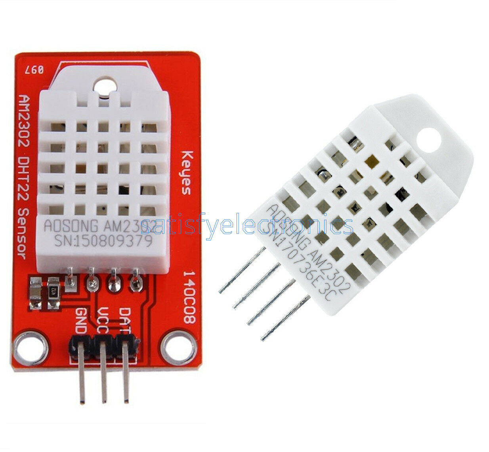
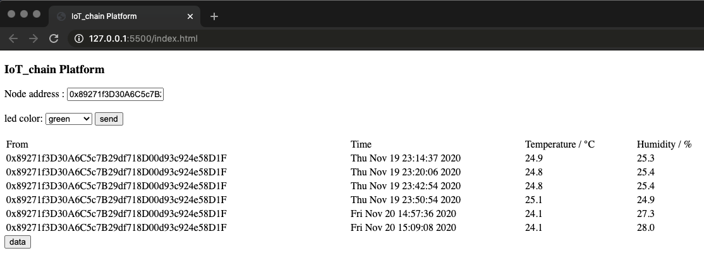

# IoT chain: A Blockchain-enabled Decentralized Data Collection and Storage Platform for IoT

Since Bitcoin's emergence in 2008, blockchain has been the next revolutionary technology. A blockchain is a decentralized and distributed ledger that consists of connected blocks of transactions. Ethereum is a Blockchain 2.0 platform that allows developers to build a Decentralized Application(DApp) without building a new blockchain from the scratch. IoT is the technology to embed all the physical devices with sensors and chips to provide automation process via machine-to-machine communication. However some serious challenges remain impossible to address due to the finite resources of IoT devices and the centralized system architecture, such as: central server congestion, single point of failure, and the risk of malicious use of personal information. Our project is aiming to build a system with Ethereum Blockchain, Raspberry Pi, Web pages, DHT22 temperature and humidity sensors. The system is a proof-of-concept prototype to simulate smart home applications. It collects the real-time temperature and humidity by DHT22 via Raspberry Pi. The sensor data will be updated to the Blockchain and stored on the smart contract deployed on the Ethereum. We can also control the LED via sending transactions to smart contract and all transactions are recorded and unmodifiable.

## 1. System Architecture


In this project, a system prototype was built to show a possible combination of IoT and Blockchain. This system prototype is to simulate the smart home applications with smart contract and data storage. A Raspberry Pi is used to collect the sensor data from the temperature and humidity sensors, DHT22, when the button is pressed. The captured data is then shown in the console and the web page, which is built by HTML and Javascript, for the user to monitor and interact with the smart contract easily. At the same time, the collected sensor data would be stored on the smart contract built on Ethereum. This system results in a new way for data storing and reading of smart home applications. The Raspberry Pi would send and read the data to and from the Blockchain by running a Python program in the Linux runtime environment. Users can also set the color code to change the color of LED controlled by Raspberry Pi. Whenever the values were changed, the Python program running on the Raspberry Pi will change the color of the LED to the corresponding color code set by the users on the smart contract. This is a demonstration system as a smart home automation application that would turn on or off the air-conditioner or humidifier, when recieving the corresponding  command from the web page. 

### 1.1. The Advantages of Our Proposed Scheme

The significant advantages compared with the traditional smart home application are as follow:

>- Ethereum Blockchain is used to replace the central server, avoiding system paralysis caused by network attacks or system failures.
>
>- All instructions are traceable. The instructions are sent to the smart contract through transactions and will only be executed after being mined.
>- Avoid running full nodes on the Raspberry Pi, which has lower requirements for hardware storage space and computing power.
>- Access to the system is convenient; as long as you send transactions to a specific smart contract through your ethereum account, you can join the system.
>- By setting different gas prices, the network delay is controlled within a reasonable range, and the cost is reduced.

## 2. Raspberry Pi

A Raspberry Pi 3 Model B+ is a credit card-sized computer with a 1.4 GHz processor and a gigabit Ethernet or 2.4/5 GHz dual-band 802.11ac Wi-Fi. The tiny computers regularly feature as media centers or Network Attached Storage controllers. Many operating systems are available for Raspberry Pi, including Raspberry Pi OS, our official supported operating system, and operating systems from other organisations. Raspberry Pi OS is the recommended operating system for normal use on a Raspberry Pi. It is a free operating system based on Debian, optimised for the Raspberry Pi hardware. It comes with over 35,000 packages: precompiled software bundled in a nice format for easy installation on your Raspberry Pi.


### 2.1. Sensors and Wire Connection

In this section, we will introduce the sensors including DHT22, button, RGBLED, and corresponding wire connection and python library.

####2.1.1. Temperature Humidity Sensor DHT22

The DHT-22 is a digital-output relative humidity and temperature sensor. It uses a capacitive humidity sensor and a thermistor to measure the surrounding air, and spits out a digital signal on the data pin.



**Technical Details**

> - Low cost
>
> - 3 to 5V power and I/O
>
> - 2.5mA max current use during conversion (while requesting data)
>
> - Good for 0-100% humidity readings with 2-5% accuracy
>
> - Good for -40 to 80°C temperature readings ±0.5°C accuracy
>
> - No more than 0.5 Hz sampling rate (once every 2 seconds)
>
> - Body size 27mm x 59mm x 13.5mm (1.05" x 2.32" x 0.53")

#### 2.1.2.  CircuitPython-DHT Library

We need to install a library to communicate with the DHT sensor. We're going to install the CircuitPython_DHT library. This library works with both the DHT22 and DHT11 sensors.

Run the following command to install the CircuitPython-DHT library:

```shell
pip3 install adafruit-circuitpython-dht

sudo apt-get install libgpiod2
```

#### 2.1.3. Setting the Pin Port

 We're using a Raspberry Pi with a DHT22 sensor connected to **Pin 14**.

```python
import board
import adafruit_dht

sensor = adafruit_dht.DHT22(board.D14)
```

####2.1.4. Installing GPIO Zero

GPIO Zero is installed by default in the Raspberry Pi OS image. Follow this guide to installing on Raspberry Pi OS Lite or other operating systems. In Python, libraries and functions used in a script must be imported by name at the top of the file. This library uses Broadcom (BCM) pin numbering for the GPIO pins, as opposed to physical (BOARD) numbering. Unlike in the RPi.GPIO library, this is not configurable. Any pin marked GPIO in the diagram below can be used as a pin number. For example, if an DHT22 was attached to GPIO14 you would specify the pin number as 14 rather than 8.

```shell
sudo apt update # update your repositories list

sudo apt install python3-gpiozero # install the package for Python 3
```

#### 2.1.5. Setting Button and RGBLED

We're connecting button to **Pin 2** and RGBLED red to **Pin 10**, green to **Pin 9** and blue to **Pin 11**.

```python
from gpiozero import Button, RGBLED

button = Button(2)
led = RGBLED(red=9, green=10, blue=11)
```


### 2.2. Infura API

Ethereum is a global network designed to process instructions in a decentralized way, relying on the processing power and storage resources of multiple computers or nodes. For Ethereum to work in a decentralized way it needs a distributed network of nodes that can verify blocks and transaction data. We avoid running a full node on Raspberry Pi and use a light-weight client to interact with Ethereum through Infura API.

Infura is a platform as a service for Ethereum networks. Using Infura, you can connect to Ethereum Test or Main networks by exposing a URL, where request response times are up to 20 times faster than other services and self-hosted solutions. Infura is a hosted Ethereum node cluster that lets your users run your application without requiring them to set up their own Ethereum node or wallet. For security reasons, Infura does not manage your private keys, which means Infura cannot sign transactions on your behalf.

**Infura uses case**

> - Associate your DApp with any of the Ethereum systems (test or Main) without setting the Ethereum Network.
>
> - Concentrate just on the application includes for some time without thinking about which arrangement it will run on.
>
> - Deploy and interact with your block shape and Infura makes it very easy to interact with the blockchain without lawn downloading any of the blocks.


#### 2.2.1. Infura Dashboard

We using dashboard generated Project ID with our API requests will now have visibility into exactly how our application is using Infura. This includes our most common methods, request volume, and bandwidth usage. 

Here are a few of the future benefits the Infura Dashboard and new authentication will provide:

> - Increase to the overall health and performance of Infura by adding protection from bad actors and attacks;
>
> - The all new Stats page, showing your application’s Ethereum node usage, with more advanced analytics to come;
>
> - Opt-in early access to new Infura features such as GraphQL APIs for Ethereum and Gas and Network Health data;
>
> - Monitoring and alerting to help you better manage your application;


#### 2.2.2. Infura Connection Provider

Web3.py is a Python library for interacting with Ethereum. It’s commonly found in decentralized apps to help with sending transactions, interacting with smart contracts, reading block data, and a variety of other use cases. Web3.py can be installed using `pip3` as follows:

```shell
pip3 install web3
```

The quickest way to interact with the Ethereum blockchain is to use a remote node provider, like Infura. You can connect to a remote node by specifying the endpoint.

```python
from web3 import Web3

infura_url = "https://ropsten.infura.io/v3/YOUR_PROJECT_ID"
w3 = Web3(Web3.HTTPProvider(infura_url))
w3.isConnected() // True
```

### 2.3. Web3.py Library

Web3.py can help us develop clients that talk to the blockchain, crafting code that reads and writes data from the blockchain(this includes smart contract interaction). And not necessarily clients like user-facing applications (web applications for example), but clients that transact with the blockchain by reading information from it, writing new transaction data to it, or executing business logic with smart contracts. Since we're writing python this client might be a script that scrapes blockchain data, or a server process that executes a smart contract function for example. Web3.py is collection of libraries that enable you to do these kinds of things: create Ethereum transactions, read and write data from smart contracts, create smart contracts, and so much more.

Web3.py talks to The Ethereum Blockchain with JSON RPC, which stands for Remote Procedure Call protocol. Ethereum is a peer-to-peer network of nodes that distributes all its data across each node in the network. In other words, each node on the network gets a copy of all the code and the data on the network. Web3.py allows us to make requests to an individual Ethereum node on behalf of the entire network with JSON RPC. This will allow us to read and write data to the network through a single node. It's kind of like making HTTP requests to a JSON API on a web server.

#### 2.3.1. Gas Price Strategy

For Ethereum transactions, gas price is a delicate property. For this reason, Web3.py includes an API for configuring it. By default, Web3.py will not include a gas price in the transaction as to relay this responsibility to the connected node. The Gas Price API allows you to define Web3.py’s behaviour for populating the gas price. This is done using a Gas Price Strategy, a method which takes the Web3.py object and a transaction dictionary and returns a gas price (denominated in wei). To retreive the gas price using the selected strategy simply call generateGasPrice().

The following ready to use versions of this strategy are available:

> - web3.gas_strategies.time_based.fast_gas_price_strategy: Transaction mined within 60 seconds.
> - web3.gas_strategies.time_based.medium_gas_price_strategy: Transaction mined within 5 minutes.
> - web3.gas_strategies.time_based.slow_gas_price_strategy: Transaction mined within 1 hour.
> - web3.gas_strategies.time_based.glacial_gas_price_strategy: Transaction mined within 24 hours.

```python
w3.eth.setGasPriceStrategy(fast_gas_price_strategy) # Set gas price strategy
gas_price = w3.eth.generateGasPrice() # Get estimated gas price
```

#### 2.3.2. Smart Contract Object

The contract object makes it easy to interact with smart contracts on the ethereum blockchain. When you create a new contract object you give it the json interface of the respective smart contract and web3.py will auto convert all calls into low level ABI calls over RPC for you.

```python
contract_address = "YOUR CONTRACT ADDRESS..."
abi = json.loads('YOUR CONTRACT ABI...')

# Build your smart contract
contract = w3.eth.contract(address=contract_address, abi=abi) 
```

#### 2.3.3. Contract Functions

The named functions exposed through the contract's functions property are of the ContractFunction type. This class is not to be used directly, but instead through Contract.functions.

```python
# Build add_records function
function = contract.functions.add_records(timestamp_encode, 
                                          temperature_encode, humidity_encode)
```

####2.3.4. Signing and Send Transaction

Signing transactions is the only way for you to prove to the Blockchain you are who you claimed to be. It is a fundamental concept when working with the Ethereum Web3.py library. You can sign transactions using a private key for the address that is initiating the transaction. For security reasons, take extra care when handling private keys.

```python
account_address = "YOUR ACCOUNT ADDRESS..."
private_key = "YOUR PRIVATE KET..."

nonce = w3.eth.getTransactionCount(account_address)
tx = function.buildTransaction({"nonce": nonce})  # Build transaction
signed_tx = w3.eth.account.signTransaction(tx, private_key) # Sign the transaction
tx_hash = w3.eth.sendRawTransaction(signed_tx.rawTransaction) # Send raw transaction
receipt = w3.eth.waitForTransactionReceipt(tx_hash) # Get your receipt
```

#### 2.3.5. Setting Event Log Filters

Events and logs are important in Ethereum because they facilitate communication between smart contracts and their user interfaces. In traditional web development, a server response is provided in a callback to the frontend. In Ethereum, when a transaction is mined, smart contracts can emit events and write logs to the blockchain that the frontend can then process. 

There are 3 main use cases for events and logs:

>- Smart contract return values for the user interface
>
>- Asynchronous triggers with data
>
>- A cheaper form of storage

```python
event_filter = contract.events.led.createFilter(fromBlock="latest",
                                                argument_filters={"_to": account_address}) # Set event filters
events = event_filter.get_new_entries() # Get all events
```

## 3. Ethereum

Ethereum is a decentralized platform that runs smart contracts. Smart contracts are applications that run exactly as programmed without any possibility of downtime, censorship, fraud, or third-party interference. In the Ethereum, there is a single, canonical computer called the Ethereum Virtual Machine, whose state everyone on the Ethereum network agrees on. Everyone who participates in the Ethereum network keeps a copy of the state of this computer. Additionally, any participant can broadcast a request for this computer to perform arbitrary computation. Whenever such a request is broadcast, other participants on the network verify, validate, and carry out the computation. This causes a state change in the EVM, which is committed and propagated throughout the entire network.

Requests for computation are called transaction requests, the record of all transactions as well as the EVM’s present state is stored in the blockchain, which in turn is stored and agreed upon by all nodes. Cryptographic mechanisms ensure that once transactions are verified as valid and added to the blockchain, they can’t be tampered with later, the same mechanisms also ensure that all transactions are signed and executed with appropriate permissions.

### 3.1. Smart Contract

A smart contract is simply a program that runs on the Ethereum blockchain. It's a collection of code and data that resides at a specific address on the Ethereum blockchain. Smart contracts are a type of Ethereum account. This means they have a balance and they can send transactions over the network. However they're not controlled by a user, instead they are deployed to the network and run as programmed. User accounts can then interact with a smart contract by submitting transactions that execute a function defined on the smart contract. Smart contracts can define rules, like a regular contract, and automatically enforce them via the code.

This contract will store the temperature and humidity of the DHT22 sensors. Events will be used to log the historical data of the temperature and humidity. When we press the button, the Raspberry Pi will upload the current temperature and humidity to smart contract through Infura. Raspberry Pi also can subscribe an event about led color, when the color code is changed, the LED will trun to the corresponding color.

The smart contract is tested and deployed on the official online Ethereum IDE Remix. We construct and test the smart contract on Remix, and make sure it can work properly. Figure below shows the variables and functions defined in the smart contract. The basic logic workflow is shown by the arrows.


There are two main functions and two events in this contract: 1) *add_records*(): update the temperature and humidity value from Raspberry Pi; 2) *control_led()*: update the color code from webpage; 3) *records()*: record all temperature and humidity data; 4) *led()*: set the color code.

```javascript
contract IoT_chain is mortal {
    
    event records(address indexed _from, bytes time, bytes temp, bytes hum);
    event led(address indexed _from, address indexed _to, uint8 color);
    
    function add_records(bytes memory time, bytes memory temp, bytes memory hum) public {
        emit records(msg.sender, time, temp, hum);
    }
    
    function control_led(address _to, uint8 color) public {
        emit led(msg.sender, _to, color);
    }
}
```

### 3.2. Event and Log

In the traditional world, applications often use logs to capture and describe what’s going on at a specific moment. These logs are often used to debug applications, detect specific events, or notify the viewer of the logs that something happened. It turns out they are also very useful when writing or interacting with smart contracts. The EVM currently has 5 opcodes for emitting event logs: *LOG0*, *LOG1*, *LOG2*, *LOG3*, and *LOG4*. A log record can be used to describe an event within a smart contract, like a token transfer or a change of ownership. Each log record consists of both topics and data. Topics are 32-byte (256 bit) words that are used to describe what’s going on in an event. Different opcodes are needed to describe the number of topics that need to be included in the log record. For instance, LOG1 includes one topic, while LOG4 includes four topics. Therefore, the maximum number of topics that can be included in a single log record is four.

The first part of a log record consists of an array of topics. These topics are used to describe the event. The first topic usually consists of the signature (a keccak256 hash) of the name of the event that occurred, including the types (uint256, string, etc.) of its parameters. One exception where this signature is not included as the first topic is when emitting anonymous events. Since topics can only hold a maximum of 32 bytes of data, things like arrays or strings cannot be used as topics reliably. Instead, it should be included as data in the log record, not as a topic. If you were to try including a topic that’s larger than 32 bytes, the topic will be hashed instead. As a result, this hash can only be reversed if you know the original input. In conclusion, topics should only reliably be used for data that strongly narrows down search queries (like addresses). In conclusion, topics can be seen as indexed keys of the event that all map to the same value, which we will talk about next.

The second part of a log record consists of additional data. Topics and data work best together as there are upsides and downsides to each. For example, while topics are searchable, data is not. But, including data is a lot cheaper than including topics. Additionally, while topics are limited to 4 \* 32 bytes, event data is not, which means it can include large or complicated data like arrays or strings. Therefore, the event data can be seen as the value. In our application, the topic is about the node address and functions, and the related sensor data is stored in the data part.


## 4. Decentralized Application

We build a Dapp web interface, used for the applications that are developed and operate on the Ethereum blockchain. On Etherscan, users can interact with dapps on the dapps' respective personalized Dapp Page. On a typical Etherscan Dapp Page, users can learn more about the dapp's background, official channels and also connect to their Web3 wallets to interact with the dapp's read and write functions. In a way, it can be said that the Etherscan Dapp web interface is the unofficial front-end interface for dapps - that is updated by the dapp's official developer, of course.



### 4.1. MetaMask

MetaMask is a browser plugin, available as the MetaMask Chrome extension or Firefox Add-on. At its core, it serves as an Ethereum wallet: By installing it, you will get access to a unique Ethereum public address, with which you can start sending and receiving ether or tokens.

But MetaMask does something more than an Ethereum wallet. As a browser extension, it can interact with the current webpage you’re browsing. It does so by injecting a JavaScript library called web3.js in every webpage you visit. Once injected, a `web3` object will be available via `window.web3` in the JavaScript code of this website. To have a look at what this object looks like, just type `window.web3` in the Chrome or Firefox DevTools console, if you have MetaMask installed.

####4.1.1. Connecting Web3.js to MetaMask

To develop for MetaMask, install MetaMask on your development machine. Once MetaMask is installed and running, you should find that new browser tabs have a `window.ethereum` object available in the developer console. This is how your website will interact with MetaMask.

```javascript
const Web3 = require("web3")
const w3 = new Web3(web3.currentProvider)
window.ethereum.enable()
```

When open the web page, you should connect your Ethereum account with MetaMask.


### 4.2. Web3.js

Web3.js provides us with JavaScript APIs to communicate with geth. It uses JSON-RPC internally to communicate with geth. Web3.js can also communicate with any other kind of Ethereum node that supports JSON-RPC. It exposes all JSON-RPC APIs as JavaScript APIs, that is, it doesn't just support all the Ethereum-related APIs, it also supports APIs related to Whisper and Swarm.

#### 4.2.1. Smart Contract Object

The `web3.eth.Contract` object makes it easy to interact with smart contracts on the ethereum blockchain. When you create a new contract object you give it the json interface of the respective smart contract and web3 will auto convert all calls into low level ABI calls over RPC for you. Contract object is similar to Web3.py, which interact with smart contracts on the ethereum blockchain. 

```javascript
var address
w3.eth.getAccounts()
.then(accounts => {
    address = accounts[0]
    console.log(address)
})

const contractAddress = "YOUR CONTRACT ADDRESS..."
const abi = YOUR CONTRACT ABI...

const contract = new w3.eth.Contract(abi, contractAddress)

const nodeAddress = document.getElementById("node_address")
const color = document.getElementById("color")
```

####4.2.2. Sending Transaction

This fucntion allows us to send color code to smart contracts . It will send a transaction to the smart contract and execute its method. This can alter the smart contract state.

```javascript
sendTx = function() {
    try {
        contract.methods.control_led(nodeAddress.value, color.value).send({
            from: address
        }).then(receipt => {
            console.log(receipt)
            alert("Successfully sent to Ethereum!")
        })
    } catch(error) {
        alert(error)
    }
}
```

When sending a transaction, you can set the gas price and gas limit to make the transaction mined in a proper time range.


####4.2.3. Getting Past Events

We can use web3.js to query all past events that a contract has ever emitted. The `getPastEvents()` will return an array of event objects. However it is currently limited to one thousand results at a time, it will return an error if more results would be returned. The first argument allows you to specify the event type to query, or `allEvents()` to return all event types. The second argument is a filter object that allows you to filter by start and end block. You can also specify the type of event your want to query. We query all "records" events and present on the web page.

```javascript
getData = function() {
    contract.getPastEvents(
        "records", 
        {
            fromBlock: 0,
            toBlock: "latest"
        },
        (err, events) => {
            console.log(events)
            var data = document.getElementById("data")
            data.innerText = ""
            var row = document.createElement("tr")
            var cell1 = document.createElement("td")
            cell1.innerText = "From"
            var cell2 = document.createElement("td")
            cell2.innerText = "Time"
            var cell3 = document.createElement("td")
            cell3.innerText = "Temperature / °C"
            var cell4 = document.createElement("td")
            cell4.innerText = "Humidity / %"
            row.appendChild(cell1)
            row.appendChild(cell2)
            row.appendChild(cell3)
            row.appendChild(cell4)
            data.appendChild(row)
            for (i in events) {
                var event = events[i].returnValues
                var row = document.createElement("tr")
                var cell1 = document.createElement("td")
                cell1.innerText = event._from
                var cell2 = document.createElement("td")
                cell2.innerText = fromHex(event.time)
                var cell3 = document.createElement("td")
                cell3.innerText = fromHex(event.temp)
                var cell4 = document.createElement("td")
                cell4.innerText = fromHex(event.hum)
                row.appendChild(cell1)
                row.appendChild(cell2)
                row.appendChild(cell3)
                row.appendChild(cell4)
                data.appendChild(row)
            }
        }
    )
}
```

####4.2.4 Decode the Data from Contract

The data stored on the Ethereum is in hexadecimal, we need to convert it to readable characters.

```javascript
function fromHex(hex) {
    var s = ''
    for (var i = 0; i < hex.length; i+=2) {
        s += String.fromCharCode(parseInt(hex.substr(i, 2), 16))
    }
    return decodeURIComponent(escape(s))
}
```

## 4. Conclusion

In this project, a system is successfully built with the combination of Ethereum private Blockchain, Raspberry Pi 3 Model B+, DHT22 temperature and relative humidity sensor and Web Page. This system prototype is to simulate a smart home application that updates the real-time temperature and humidity to the user and control remotely when a certain situation occurs. The sensor data is stored on the smart contract and the turning on or off the LED as a warning is the reactions for this system. We can also handle the latency in a proper range, within 60 seconds. The cost of building this system is quite reasonable, which would cost low than $100, for smart home applications. Instead, turning on or off corresponding LED is implemented as a simulation process. This could be further improved by researching the process controlling air-conditioner and humidifier by the infra-red controller. An additional process must be conducted, which is keeping enough tokens stored in the Ethereum account of the Raspberry Pi to interact with the smart contract. Since whenever an account wants to send a transaction or call a smart contract on the Ethereum Blockchain, the account needs to pay certain token as a gas fee for the transactions to be made successfully.